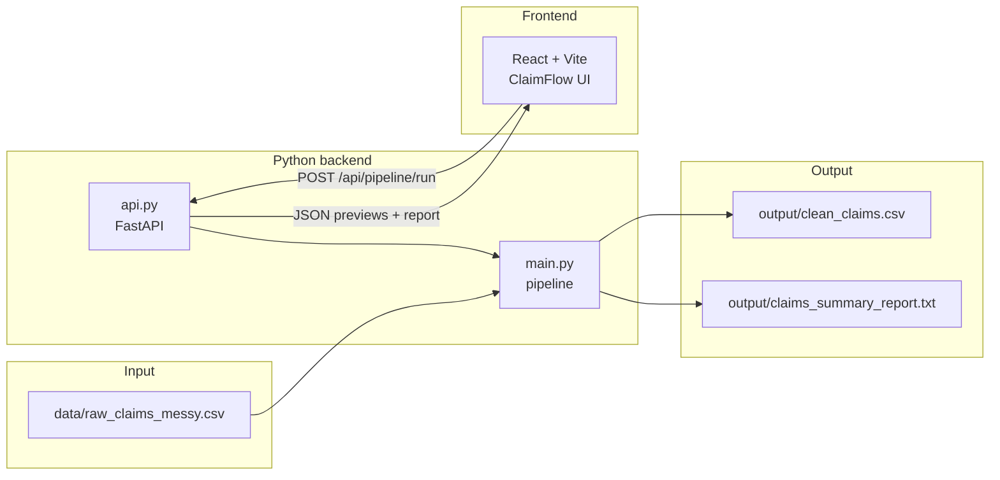

# ClaimFlow

**Workers' compensation claims automation demo** — ingest messy employer CSV exports, standardize and enrich the data, export a clean dataset, and generate an executive summary report. Includes a React UI for live walkthroughs and a CLI for scripted runs.

Built as a portfolio project to demonstrate automation patterns relevant to employer claims processing (similar workflows are often implemented with VBA, Power Automate Desktop, or ETL tools in production).

---

## Features

| Capability | Description |
|------------|-------------|
| **CSV ingestion** | Loads employer claim exports from a defined input path |
| **Data cleaning** | Normalizes dates, currency, states, statuses, and text fields; removes invalid rows and duplicates |
| **Calculated fields** | Adds `days_to_report` (report date minus injury date) for timeliness analysis |
| **File export** | Writes `output/clean_claims.csv` with consistent formatting |
| **Summary report** | Writes `output/claims_summary_report.txt` with financial, status, and operational metrics |
| **Web demo UI** | Single-page app to run the pipeline, preview raw vs. clean data, and view the report |
| **REST API** | FastAPI layer that executes the pipeline and returns JSON for the frontend |

---

## Architecture



### Pipeline stages

1. **Load** — Read raw CSV into pandas  
2. **Clean** — Strip whitespace, standardize enums, parse dates/currency, validate claim IDs, deduplicate  
3. **Calculate** — Derive `days_to_report`  
4. **Export** — Save normalized CSV  
5. **Report** — Generate text summary (totals, status breakdown, top employers/injuries, open-claim snapshot)

---

## Tech stack

| Layer | Technologies |
|-------|----------------|
| Data processing | Python 3, pandas |
| API | FastAPI, Uvicorn |
| Frontend | React 19, TypeScript, Vite |
| Sample data | Synthetic workers' comp-style claims (logistics, healthcare staffing, manufacturing, etc.) |

---

## Project structure

```
automation-project/
├── main.py                 # Core pipeline (load, clean, calculate, export, report)
├── api.py                  # HTTP API for the demo UI
├── requirements.txt        # Python dependencies
├── data/
│   └── raw_claims_messy.csv    # Sample messy input (~100 rows)
├── output/                 # Generated artifacts (gitignored recommended)
│   ├── clean_claims.csv
│   └── claims_summary_report.txt
└── frontend/
    ├── src/
    │   ├── App.tsx             # Landing page + pipeline overview
    │   ├── api/pipeline.ts     # API client
    │   └── components/         # Workspace, tables, report view
    ├── package.json
    └── vite.config.ts          # Proxies /api → localhost:8000
```

---

## Prerequisites

- **Python 3.10+** with `pip`
- **Node.js 18+** and `npm` (for the UI only)

---

## Getting started

### 1. Install Python dependencies

From the project root:

```bash
pip install -r requirements.txt
```

### 2. Run via CLI (no UI)

```bash
python main.py
```

**Console output** includes row counts and output paths.

**Generated files:**

| File | Description |
|------|-------------|
| `output/clean_claims.csv` | Normalized claims (17 columns including `days_to_report`) |
| `output/claims_summary_report.txt` | Executive summary report |

Re-running the script overwrites previous outputs.

### 3. Run the full demo (UI + API)

Use two terminals.

**Terminal 1 — API server** (project root):

```bash
uvicorn api:app --reload --port 8000
```

**Terminal 2 — Frontend** (project root):

```bash
cd frontend
npm install
npm run dev
```

Open **http://localhost:5173**, go to **Live workspace**, and click **Run pipeline**.

The Vite dev server proxies `/api` requests to `http://127.0.0.1:8000`. Both processes must be running for the UI to work.

### 4. Production build (frontend only)

```bash
cd frontend
npm run build
npm run preview
```

> The preview server still requires the API on port 8000 for pipeline execution unless you deploy both services together.

---

## API reference

| Method | Endpoint | Description |
|--------|----------|-------------|
| `GET` | `/api/health` | Health check — returns `{"status": "ok"}` |
| `POST` | `/api/pipeline/run` | Runs the full pipeline on `data/raw_claims_messy.csv` |

**`POST /api/pipeline/run` response** (abbreviated):

```json
{
  "stats": {
    "rawRows": 103,
    "cleanRows": 101,
    "removedRows": 2,
    "columnCount": 17,
    "totalPaid": 958302.4,
    "totalPaidFormatted": "$958,302.40"
  },
  "rawPreview": { "columns": [...], "rows": [...] },
  "cleanPreview": { "columns": [...], "rows": [...] },
  "report": "WORKERS' COMPENSATION CLAIMS SUMMARY REPORT\n...",
  "outputs": {
    "csv": "output/clean_claims.csv",
    "report": "output/claims_summary_report.txt"
  }
}
```

Previews return up to 15 rows for display in the UI.

---

## Data cleaning rules (summary)

The sample messy CSV intentionally includes common real-world issues. The cleaner addresses:

- **Whitespace and casing** on text fields  
- **Date formats** — multiple formats parsed to consistent dates  
- **Currency** — strips `$`, commas; handles `N/A`, `-`, and invalid values  
- **State codes** — maps variants (`ca`, `Texas`, `new york`) to two-letter abbreviations  
- **Claim status** — normalizes values (`open`, `pending review`, etc.)  
- **Validation** — drops rows with invalid `claim_id` format (`CLM-YYYY-NNN`)  
- **Deduplication** — one row per `claim_id` (first occurrence kept)  
- **Data quality** — negative `days_lost` set to missing  

---

## Sample input schema

`data/raw_claims_messy.csv` columns:

`claim_id`, `employee_id`, `employee_name`, `employer_name`, `injury_date`, `report_date`, `body_part`, `injury_type`, `claim_status`, `days_lost`, `medical_cost`, `indemnity_cost`, `total_paid`, `state`, `adjuster`, `notes`

---

## Design notes for production

This demo assumes a **fixed CSV schema**. In environments with many employer or carrier export formats, a normalization layer (configuration-based column mapping or AI-assisted schema detection) would sit **before** the stable cleaning and reporting steps. The Python pipeline is intended to remain the auditable, deterministic core after intake is standardized.

---

## Troubleshooting

| Issue | Solution |
|-------|----------|
| UI shows "Pipeline error" / fetch failed | Start the API: `uvicorn api:app --reload --port 8000` |
| `FileNotFoundError` for input CSV | Run commands from the project root; ensure `data/raw_claims_messy.csv` exists |
| Port 8000 in use | Use another port: `uvicorn api:app --port 8001` and update `frontend/vite.config.ts` proxy target |

---

## License

This project is provided for portfolio and interview demonstration purposes.
